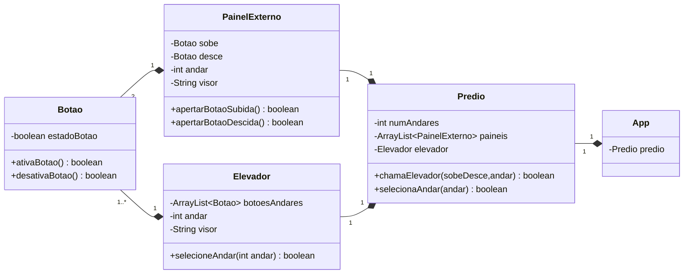

# Simulador de elevador

## Objetivos do projeto
Neste projeto, o objetivo foi realizar a criação de uma aplicação que representaria um elevador dentro de um prédio, onde o foco foi a criação de um aplicação que respeitasse o princípio da divisão de responsabilidades (SOC, Separation of Concerns) e da responsabilidade única (SRP, Single Responsibility Principle). Neste projeto, foi-se simplificado bastante coisa de um real funcionamento de um elevador em um prédio, pois não era o foco principal.

## Instruções do programa

### Requisitos
Para utilizar a aplicação será necessário ter instalado em sua máquina o ``Java`` e o ``Gradle``.

1. O primeiro passo é realizar clonar a aplicação para sua máquina

``git clone https://github.com/vgguerra/POO-Project-1-Elevator-Simulator``

2. Com o projeto em sua máquina, faça a instalação do ``gradle``, no site [gradle](https://gradle.org/install/).
3. Com o gradle corretamente instalado em sua máquina, navegue até o repositório da aplicação e digite ``./gradlew run -q`` para rodar a aplicação.

### Funcionalidades e como utiliza-lo

Ao iniciar o programa, ele irá perguntar ao usuário a quantidade de andares que o prédio terá. Após selecionar a quantidade de andares, o programa irá lhe questionar se o usuário está dentro ou fora do elevador. Caso esteja dentro, irá ser questionado ao usuário a qual andar ele deseja ir, imprimindo no terminal como está o painel do elevador em cada andar, e informando se o botão de alguma andar dentro do elevador está pressionado ou não. 

Caso o usuário informe que está fora do elevador, irá ser questionado o andar em que o mesmo está e questionando se o usuário quer subir ou descer. Após selecionar, irá ser impresso na tela o status do elevador a cada segundo, indicando se o mesmo está subindo para ir até o andar em que o usuário se encontra ou descendo, além de mostrar se o botão de subir ou descer daquele determinado andar está ou não pressionado.

Reforçando novamente, o intuito deste projeto foi se aprofundar nos conceitos da divisão de responsabilidades (SOC, Separation of Concerns) e da responsabilidade única (SRP, Single Responsibility Principle).

## Diagrama de classes UML

