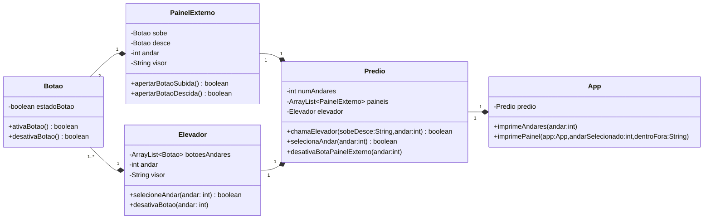

# Projeto 01 de POO - Simulador de elevador
  Neste projeto, a proposta era realizar a criação de um elevador, onde o usuário poderia arbitrar o número de andares ao iniciar o programa, indicar se estava dentro ou fora do elevador, subir e descer de um andar para outro e chamar o elevador em um determinado andar. O principal objetivo deste projeto, era utilizar o princípio da divisão de responsabilidades (SOC, Separation of Concerns) e da responsabilidade única (SRP, Single Responsibility Principle).

  ## Funcionalidades do programa
  - Chamar um elevador em um determinado andar, indicando se deseja subir ou descer
  - Indicar, quando dentro do elevador, para qual andar o usuário deseja ir, se deslocando do andar atual até o selecionado

  Abaixo, segue o diagrama de classes UML, indicando os principais atributos e os principais métodos do programa

