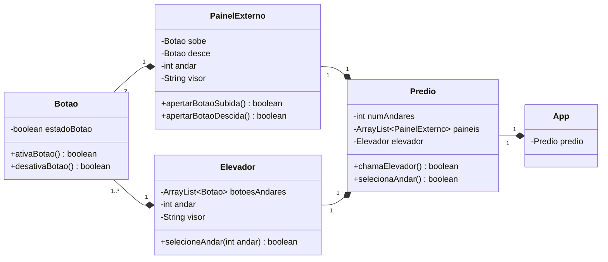

```mermaid
classDiagram
    direction LR
    direction TD

    class Botao{
      -boolean estadoBotao

      +ativaBotao() boolean
      +desativaBotao() boolean
    }

    class PainelExterno{
      -Botao sobe
      -Botao desce
      -int andar
      -String visor

      +apertarBotaoSubida() boolean
      +apertarBotaoDescida() boolean
    }

    class Elevador{
      -ArrayList~Botao~ botoesAndares
      -int andar
      -String visor

      +selecioneAndar(int andar) boolean
    }


    class Predio{
      -int numAndares
      -ArrayList~PainelExterno~ paineis
      -Elevador elevador

      +chamaElevador() boolean
      +selecionaAndar() boolean
    }

    class App{
      -Predio predio
    }


    Botao "2" --* "1" PainelExterno
    Botao "1..*" --* "1" Elevador
    PainelExterno "1" --* "1" Predio
    Elevador "1" --* "1" Predio    
    Predio "1" --* "1" App
```