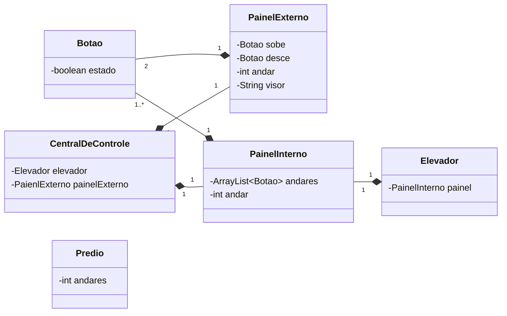

```mermaid
classDiagram
    direction LR

    class Botao{
    -boolean estado
    }

    class PainelExterno{
    -Botao sobe
    -Botao desce
    -int andar
    -String visor
    }

    class PainelInterno{
      -ArrayList~Botao~ andares
      -int andar
    }

    class Elevador{
    -PainelInterno painel
    }

    class CentralDeControle{
    -Elevador elevador
    -PaienlExterno painelExterno
    }

    class Predio{
    -int andares
    }

 

    Botao "2" --* "1" PainelExterno
    Botao "1..*" --* "1" PainelInterno
    PainelInterno "1" --* "1" Elevador
    CentralDeControle "1" *-- "1" PainelInterno
    CentralDeControle "1" *-- "1" PainelExterno
    

```